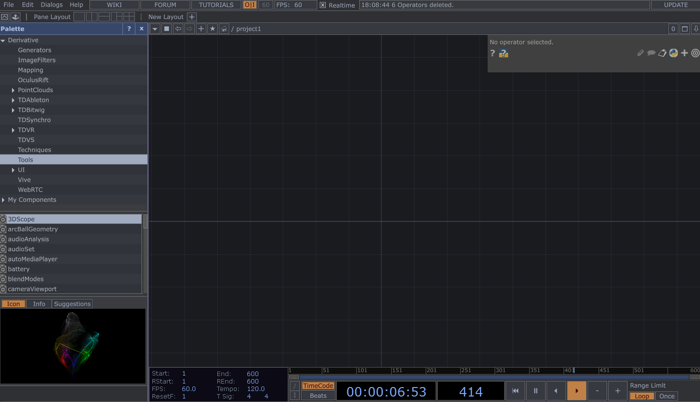
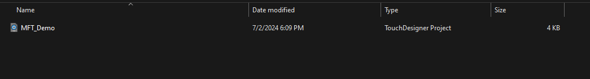
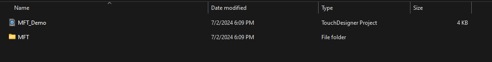
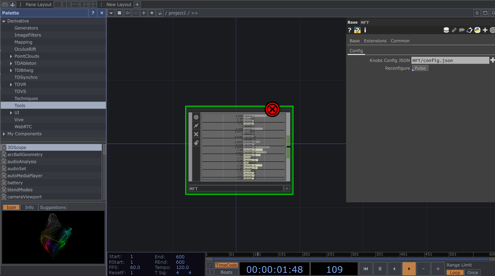
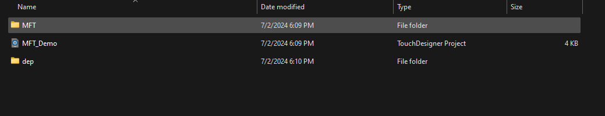

# TD-MFT
This is porting the [pymft](https://github.com/sina-cb/pymft) library to TouchDesigner.

This repo includes a sample TOE project. The sample TOE project is already adding the MFT component in an empty network.

# Usage
To use this component in TouchDesigner:
    1. Open a new project in TouchDesigner, or open your existing project.
    
    2. Save the project.
    
    3. Copy the MFT directory from this repository to the project's top directory.
    
    4. Drag and drop the MFT/MFT.tox file into your project.
    
    5. Click the "Reconfigure" button on the MFT component.
        5.1. After clicking the Reconfigure button, a new terminal should open up to install the requirements.
        5.2. You should see a new directory created in your project's top directory called "dep". This directory contains the dependencies needed for the MFT component.
        
    6. Enjoy the component in TouchDesigner!

# Midi Fighter Twister Configuration
The pymft library uses a JSON configuration to se the properties of the encoders.

There's a default configuration unser MFT/config.json which can be modified either in a text editor or directly from the MFT component in TouchDesigner.

# Future Development
- Add support for more MFT devices
- Better visualization of the knbo values based on the selected bank
- Add easy parameter binding for the knobs